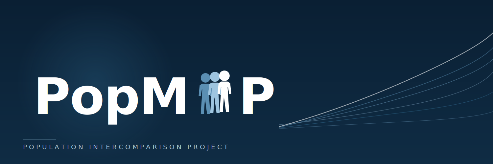

# PopMIP

Welcome to **PopMIP** - a Model Intercomparison Project within CMIP.

## Overview

PopMIP carries out coordinated evaluation and comparison of gridded population datasets to understand the differences between the datasets. The primary objectives are to:

1. **Evaluate the differences between griided population datasets** 
2. **Advocate an emsemble approach of of multiple population datasets for climate impact analysis** 
3. **Explore appraoches to evaluate the beleiveability of future population maps to a given SSP**

Your MIP is part of the Coupled Model Intercomparison Project organised by the [World Climate Research Programme](https://www.wcrp-climate.org/).

## Quick Links

| Resource | Description |
|----------|-------------|
| [Experiment Design](experiments/design.md) | Details of experimental protocols |
| [Data Requirements](experiments/data.md) | Required outputs and variables |
| [Steering Committee](about/committee.md) | Leadership and contacts |
| [Publications](about/publications.md) | Key papers and citations |

## Latest News

!!! info "CMIP7 Update"
    Your MIP is participating in CMIP7. See our [experiment design](experiments/design.md) for the latest protocols.

## Contact

For questions about Your MIP, please contact the co-chairs:

- **Laurence Hawker** - [University of Bristol] - laurence.hawker@bristol.ac.uk

---

*This MIP contributes to CMIP7.*
